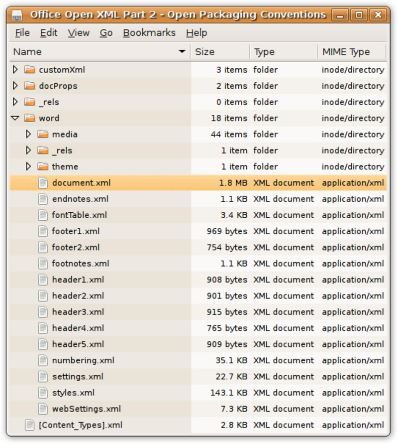
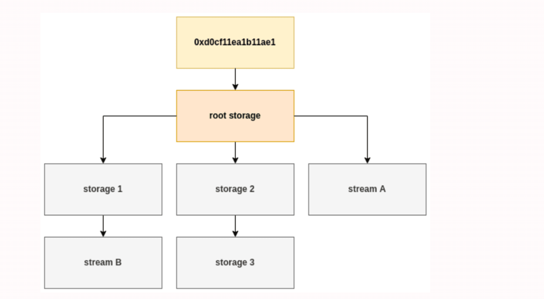

<h1>Personal Experience</h1>
It is the fourth day of my internship and I have learn many new commands of linux and the most fun part of my intern is the bandit game which is a interesting game where we can have a hand on experience on linux commands.
<h1>Static malware analysis: Office documents</h1>
<h2>What are the methods of attacks via office documents?</h2>
The first method is to use the VBA scripts or macros,both of them are attatched with the document and it will run automatically when the file is open.<br>

```

<ul>
<li>Sub HelloWorld()
    MsgBox "Hello, World!"
End Sub</li>
</ul>

```

<p>The second method is DDE(Dynamic Data Exchange),it can also automate certain task and execude certain command and it use the VBA scripts language which are currently available.It can do almost everything that malware can do.<br>
The third method is to explore the vulnerabilities that are present inside the office program itself.The process of analyzing document is to look for particular keywords which indicat harmful components.It may be a embedded file with a binary file or encoded obfuscated file.</p><br>

<p>There are two different version of MS office, the older version which was before 2007.And after 2007 it release new formate also known as open office XML formate which it self archive an dit contain xml inside.<br></p>



<h2>Microsoft Sturctured Storage Format (SSF)</h2>
It is a file format which is used to store compound document which are created through  MS application. It can store a multiple streams of data in single file.And each stream is a different entity.<br>
A compound document stored in Microsoft Office Structured Storage format consists of a root storage, which contains one or more streams and storages. Streams are used to store data, such as text or images, while storages are used to store additional streams and storages, creating a hierarchy within the compound document.<br>



<h2>Open Office XML format</h2>
It is an another formate which is in xml formate with the .docx extension and inside of it's you will find a archive that is comprised of multiple files, including the XML files.