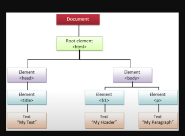

<h1>Basic Linux Commands </h1>
The commands I have use 

mkdir- Create a directory 

```
mkdir ten

```
cd- Change the current directory 
```
cd dir_name

```
rmdir- remove a directory
```
rmdir ten 

```
pwd- print the current working directory
```
pwd

```
cp- copy files or directory
```
cp main.py main_backup.py

```

esc+:+q+!-it will discart the file 
esc+:+w+q- it will save the file and execute the file 
vim- it is an editor use in linux

mv- move is use to rename and a file or directory
```
mv main_backup.py backup.py

``` 
rm - remove a file or directory
```
rm ten

```
touch- Create a new empty file
```
touch a.txt

```
cat- Concatenate and display files
```
cat a.txt

```
<h1> Java Script </h1>
variable- It is continer used for store the vaalue

```
var a=5;

```
console.log- It is use to print message to console
```
console.log("write the message")

```
string- Collection of character
```
var c="Tenzin";

```

type- It will show which data type the variable is
```
console.log(typeof a, typeof b, typeof c)

```
const- We can't change the value 
```
const a1=6;

```
let-It is a  block scope won't work out side the block. 
```
{
    
    let a =5;

}

```
object- It is key-value pair
```
let o={
    "name": "Tenzin"
}


```


<h2>Rule to Declare a variable name</h2>
<ul>
<li>Variable names must start with a letter, underscore, or dollar sign ($)</li>
<li>Variable names cannot start with a number, period (.), or dash (-)</li>
<li>Variable names cannot be reserved keywords</li>
<li>Variable names are case sensitive</li>

